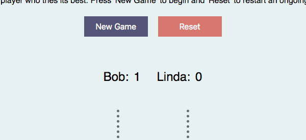

# Tic-Tac-Toe  
  
Play a few rounds of Tic-Tac-Toe against a friend or play against a computer player.  
  
## Features  
  
### New Game  
  
  
  
The game will not begin without entering the player(s) name(s). To do this, click on the `New Game` button located below the introduction.  
  
### Enter your name(s) and custom marker(s)  
  
  
  
When you click the `New Game` button below the introduction, it brings up a menu that allows you to enter your and a friend's name and a custom marker for each. If you chose not to enter a custom marker, player 1's default marker is 'x' and player 2's is 'o'. Players cannot use the same exact marker, meaning two players can use 'k' as long as one uses a capitalized version. Should the players choose the same marker, the form will not submit and will notify players that their markers must be different.   
  
### Play against a computer  
  
  
  
You can play against the computer by ticking the box under 'vs. Comp?' in the `New Game` menu. This removes the input fields needed for information about player 2 and replaces it with a short description of which marker the computer will use to prevent the user from choosing the same.  
  
While the computer player is not meant to be unbeatable (far from it), it will still attempt to win/block the player's attempts to win when a pattern is recognized. Think of it as playing against your kid-sibling who's really trying their best.  
  
### Announce winners  
  
  
  
When a player/computer has achieved three consecutive marks vertically, horizontally, or diagonally, the winner will be announced. In the case of a tie, that will also be announced.  
  
### Points  
  
  
  
In case you are planning to play multiple rounds, there is a scoreboard located above the game grid which allows you to keep track of who's slaying whom. A point is awarded for each win. 

### Reset  
  
You can reset the board in the middle of a match by pressing the `Reset` button below the introduction. This will clear the grid of all marks, but the points will remain the same. 